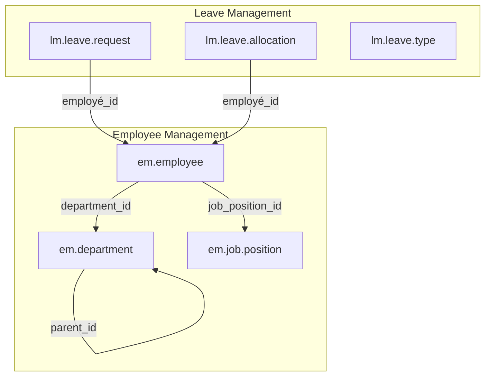

# 🌟 Odoo 16 HR Suite — Gestion des Ressources Humaines & Congés

<div align="center">


**Une suite complète de modules Odoo 16 pour la gestion moderne des Ressources Humaines.**

*Gestion des Employés · Départements · Postes · Workflow de Congés · Allocations · Attestations PDF*

</div>

---

## 📋 Table des matières

- [Aperçu du projet](#-aperçu-du-projet)
- [Modules inclus](#-modules-inclus)
  - [1. Employee Management](#1-employee-management-👥)
  - [2. Leave Management](#2-leave-management-🏖️)
- [Fonctionnalités principales](#-fonctionnalités-principales)
- [Architecture technique globale](#-architecture-technique-globale)
- [Prérequis et installation](#-prérequis-et-installation)
- [Pratiques de développement](#-pratiques-de-développement)
- [Auteur](#-auteur)
- [Licence](#-licence)

---

## 🎯 Aperçu du projet

Ce dépôt contient une suite de deux modules Odoo 16 interconnectés conçus pour offrir une expérience complète et fluide de la gestion des ressources humaines. 

Développés avec une attention particulière à la qualité du code, à l'interface utilisateur et aux bonnes pratiques Odoo, ces modules constituent une base solide pour toute organisation souhaitant numériser son département RH, ou pour les développeurs souhaitant explorer des concepts avancés (Workflows, TransientModels, Vues QWeb personnalisées, CSS Backend, Sécurité hiérarchique).

---

## 📦 Modules inclus

### 1. [Employee Management](employee_management/README.md) 👥
Le module de base (Core) qui gère l'architecture organisationnelle.
- **Cycle de vie des employés** : de l'embauche au départ, avec historique et workflow d'état (Brouillon → Actif → Suspendu / Démissionnaire).
- **Structure organisationnelle** : Départements hiérarchisés et Postes avec grilles salariales.
- **Opérations avancées** : Wizard de mutation groupée (changement de département, poste, salaire).
- **Reporting** : Fiche employé complète en PDF avec design professionnel, Dashboards (Masse salariale, effectifs).

👉 [Voir la documentation complète du module Employee Management](employee_management/README.md)

### 2. [Leave Management](leave_management/README.md) 🏖️
Le module de gestion des absences, qui s'intègre parfaitement avec les données des employés.
- **Workflow d'approbation** : Soumission, validation par les managers, ou refus motivé via Wizard.
- **Types et Allocations** : Gestion fine des quotas (Soldes) par type de congé (Annuel, Maladie, Maternité, etc.).
- **Contraintes intelligentes** : Détection de chevauchement de dates, gestion des demi-journées, pièces jointes obligatoires pour certains types.
- **Attestations officielles** : Génération de certificats de congé approuvés au format PDF.

👉 [Voir la documentation complète du module Leave Management](leave_management/README.md)

---

## ✨ Fonctionnalités principales

| Catégorie | Détails |
|---|---|
| **🏢 Structure** | Arborescence de départements avec comptage dynamique des effectifs et de la masse salariale. |
| **👤 Employés** | Fiches riches (photo, infos perso/pro, compétences, manager direct, subordonnés). |
| **🔄 Workflows** | Machines à états strictes pour les employés et les demandes de congés avec traçabilité (Chatter). |
| **🔐 Sécurité** | Niveaux d'accès granulaires (Lecteur, Employé, Manager RH, Administrateur). |
| **🎨 Interface** | Vues Form, Tree, Kanban et Dashboards repensées avec des styles CSS personnalisés (+500 lignes de CSS au total). |
| **🖨️ PDF QWeb** | Rapports soignés et professionnels (Fiches employés, Attestations de congé). |

---

## 🏗️ Architecture technique globale



- **Dépendance** : `leave_management` dépend structurellement de `employee_management`.
- **Modèles** : Utilisation intensive de contraintes SQL (`_sql_constraints`) et Python (`@api.constrains`).
- **Composants éphémères** : Wizards (`TransientModel`) pour les actions complexes nécessitant des paramètres utilisateurs (Mutations, Refus, Annulations).

---

## 🚀 Prérequis et installation

### Prérequis
- **Odoo 16.0** (Community ou Enterprise)
- **Python 3.10+**
- PostgreSQL

### Guide d'installation

1. **Cloner le dépôt complet**
   ```bash
   git clone https://github.com/ramisarivelo/odoo-hr-modules.git
   ```

2. **Ajouter les modules au répertoire addons d'Odoo**
   Vous pouvez copier les dossiers ou créer un lien symbolique :
   ```bash
   cp -r odoo-hr-modules/employee_management /path/to/odoo/addons/
   cp -r odoo-hr-modules/leave_management /path/to/odoo/addons/
   ```

3. **Mettre à jour la configuration Odoo**
   Assurez-vous que votre chemin est bien défini dans `odoo.conf` :
   ```ini
   addons_path = /usr/lib/python3/dist-packages/odoo/addons,/path/to/odoo/addons
   ```

4. **Installer les modules dans le bon ordre**
   Activez le mode développeur dans Odoo, mettez à jour la liste des applications, puis installez :
   - D'abord : **Employee Management**
   - Ensuite : **Leave Management**

---

## 🛠️ Pratiques de développement mises en œuvre

Ces modules ont été conçus comme une vitrine technique des capacités du framework Odoo 16 :
- **Vues conditionnelles** : Masquage de champs et boutons selon l'état (`attrs="{'invisible': ...}"`) ou le groupe d'accès.
- **Performance** : Utilisation de `mapped()`, `filtered()`, et opérations en lot (batch) dans les méthodes Python.
- **Sécurité** : Règles de sécurité `ir.model.access.csv` et fichiers `security.xml` respectant le principe de moindre privilège.
- **UX/UI** : Ajout de styles Backend CSS (injection via `assets.xml`) pour une interface utilisateur qui se démarque du standard.
- **Séquences** : Génération automatique et thread-safe de références (`EMP-XXXX`, `CONG/YYYY/NNNN`).

---

## 👨‍💻 Auteur

**Mickaël Ramisarivelo**
- GitHub : [@ramisarivelo](https://github.com/ramisarivelo)
- LinkedIn : [Mickaël Ramisarivelo](https://linkedin.com/in/mickael-ramisarivelo)
- Email : ramisarivelomickael@gmail.com

---

## 📄 Licence

L'ensemble de ce code source est distribué sous licence **LGPL-3**. Voir le fichier [LICENSE](LICENSE) pour plus de détails.

---

<div align="center">

**⭐ Si ce projet complet vous a aidé ou inspiré, n'hésitez pas à laisser une étoile sur GitHub !**

*Développé avec ❤️ pour la communauté Odoo*

</div>
